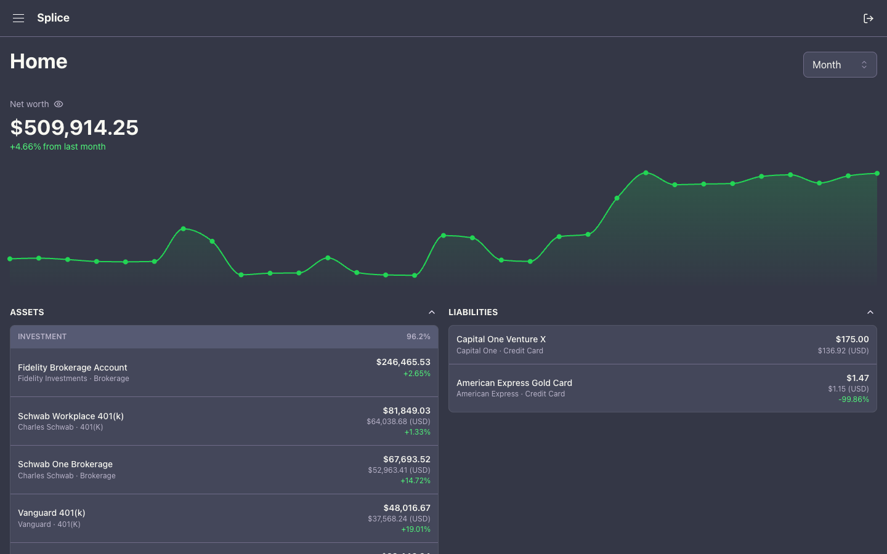
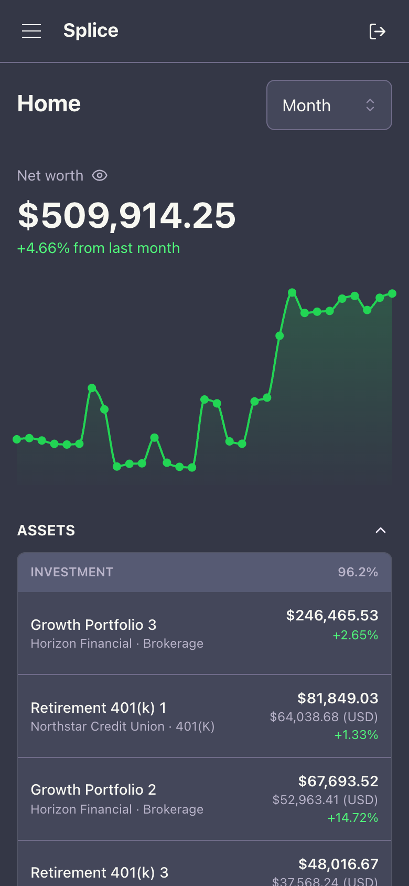
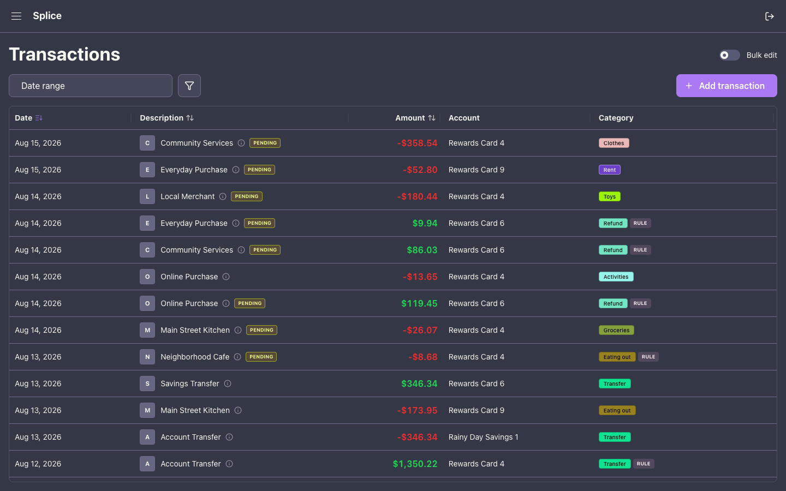
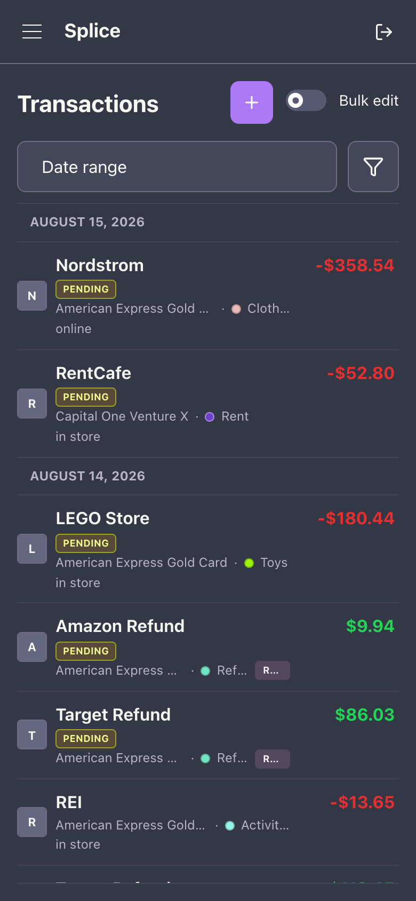
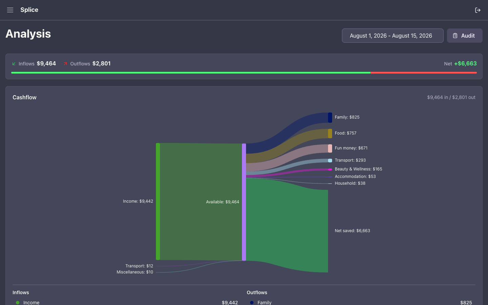
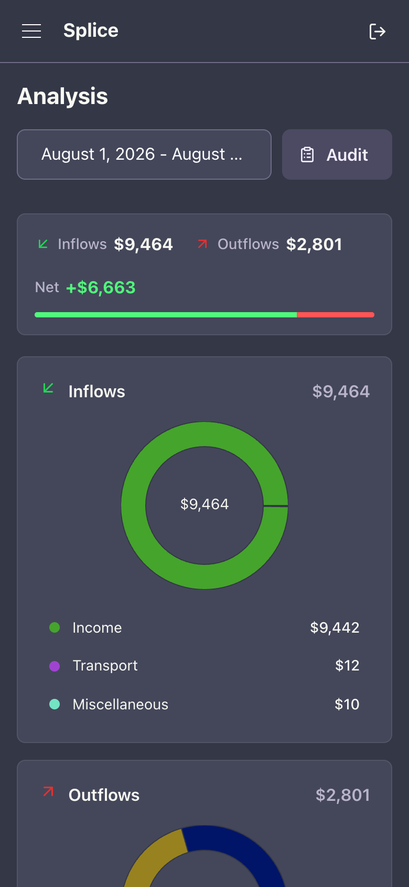

<p align="center">
  
</p>

# Splice

Splice is a self-hosted personal finance dashboard for net worth, transactions, investments, and cashflow analysis across accounts and currencies.

## Screenshots

| Feature | Description | Desktop | Mobile |
| --- | --- | --- | --- |
| Home dashboard | Track net worth over time and see assets and liabilities grouped by account type. | <a href="docs/screenshots/home-desktop.png"></a> | <a href="docs/screenshots/home-mobile.png"></a> |
| Transactions | Review transactions with dates, statuses, signed amounts, accounts, and categories in a responsive ledger. | <a href="docs/screenshots/transactions-desktop.png"></a> | <a href="docs/screenshots/transactions-mobile.png"></a> |
| Cashflow analysis | Compare inflows and outflows with a Sankey diagram on desktop and category breakdowns on mobile. | <a href="docs/screenshots/analysis-desktop.png"></a> | <a href="docs/screenshots/analysis-mobile.png"></a> |

## Features

- **Accounts and net worth**<br>
  Link accounts through Plaid or add them manually, then track cash, credit, loans, investments, and crypto across currencies.

- **Smart transaction management**<br>
  Review enriched activity, bulk-edit transactions, create custom categories, and automate categorization with reusable rules.

- **Cashflow analysis**<br>
  Explore inflows, outflows, and net savings through interactive visualizations, drilldowns, and an audit view.

- **Investments and history**<br>
  Inspect holdings and investment activity while daily snapshots and CSV backfills preserve historical balances.

- **Automation and access**<br>
  Schedule recurring transactions, receive browser notifications, and connect external tools through REST API personal access tokens or OAuth-secured MCP.

## Quick Start

### Prerequisites

- Node.js 24+
- Yarn
- Docker (for PostgreSQL)

### 1. Configure the environment

From the repository root:

```bash
cp backend/.env.example backend/.env
cp frontend/.env.example frontend/.env
```

Set a non-empty `JWT_SECRET` in `backend/.env`, then configure either Google OAuth or the local development bypass described under [Authentication](#authentication).

### 2. Start PostgreSQL and the backend

```bash
cd backend
yarn install
docker compose up -d postgres
yarn migration:run
yarn dotenv -- nest start --watch
```

The API runs on `http://localhost:3000`.

### 3. Start the frontend

In another terminal:

```bash
cd frontend
yarn install
yarn dev
```

Open `http://localhost:4000`.

### Common commands

Run commands from the project that owns them:

| Project | Commands |
| --- | --- |
| Backend | `yarn lint`, `yarn typecheck`, `yarn test`, `yarn test:e2e`, `yarn migration:run` |
| Frontend | `yarn lint`, `yarn typecheck`, `yarn test`, `yarn build`, `yarn orval` |

## Architecture

| Layer | Technology |
| --- | --- |
| Backend | NestJS, TypeORM, PostgreSQL |
| Frontend | React 19, TanStack Router, TanStack Query, Mantine UI, Tailwind CSS |
| API contract | Zod schemas → OpenAPI → Orval-generated client |
| Authentication | Google OAuth, HTTP-only JWT cookies, personal access tokens |

Backend Zod schemas define validation and the OpenAPI contract; `yarn orval` regenerates the frontend client from that contract. See [Architecture](docs/architecture.md) for data ownership, provider integration, money handling, and background jobs.

## Authentication

### Google OAuth

Create a Google OAuth 2.0 web client with:

- JavaScript origin: `http://localhost:4000`
- Redirect URI: `http://localhost:3000/user/oauth/google/callback`

Then set:

```env
GOOGLE_OAUTH_CLIENT_ID=<google web client id>
GOOGLE_OAUTH_CLIENT_SECRET=<google web client secret>
GOOGLE_OAUTH_CALLBACK_URL=http://localhost:3000/user/oauth/google/callback
GOOGLE_ALLOWED_EMAILS=alice@example.com,bob@example.com
```

Only verified addresses in the comma-separated `GOOGLE_ALLOWED_EMAILS` allowlist can sign in or be provisioned.

### Local development bypass

```env
LOCAL_AUTH_BYPASS=true
LOCAL_AUTH_BYPASS_EMAIL=dev@example.com
```

After both apps are running, open:

```text
http://localhost:3000/user/dev/login?redirect=/home
```

This endpoint is restricted to local development. Never enable the bypass in staging or production. External REST API clients can use personal access tokens created in Settings. MCP clients use OAuth at the public endpoint documented in the [MCP guide](docs/mcp.md).

## Deployment

Production releases are promoted from `main` to the protected `deploy` branch through the [Deploy workflow](.github/workflows/deploy.yml). The workflow creates or updates a deployment PR, validates the exact commit through CI, and merges it after the checks pass.

See the [Deployment guide](docs/deployment.md) for production configuration and release steps.

## API Documentation

OpenAPI docs available at `http://localhost:3000/api` when backend is running.
