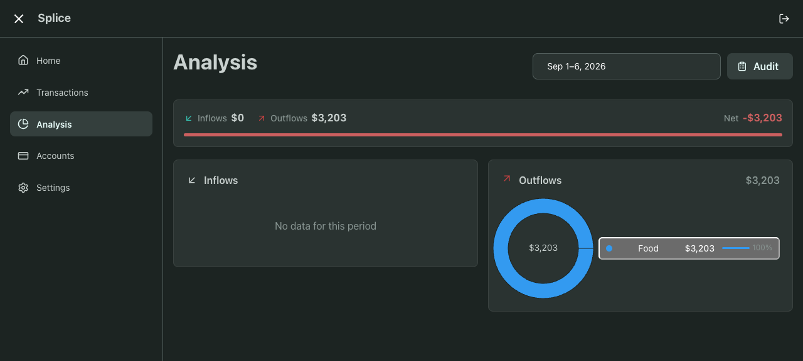
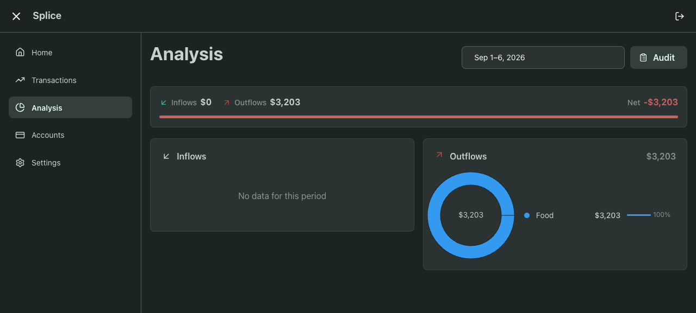

# Client navigation and shared styles regression

Validated against a local production build based on release `dfa5718`, with a migrated synthetic PostgreSQL fixture. No production services or user financial data were changed.

## Reproduction and fix

Navigating from a server-rendered Transactions page to Analysis removed the shared Pressable stylesheet. Vite had already marked it loaded, so subsequent imports did not restore it. Category buttons rendered with native gray backgrounds and borders, matching the reported symptom. Application component CSS now stays in one root stylesheet (23 KB uncompressed, approximately 5 KB gzip); JavaScript remains split by route. A small Vite build hook attaches that asset to the entry metadata consumed by the installed TanStack Start SSR manifest.

Cold route loaders also awaited financial data in the browser. With a synthetic four-second analysis delay, the URL changed immediately but the Transactions heading remained until 4,101 ms. The shared loader now awaits essential data on the server and starts the same deduplicated queries without blocking client navigation. The destination's existing loading/error states own the request. Transactions' infinite query and Settings' selected-section loader use the same boundary. Pending route code displays a loading status after 150 ms, with no artificial minimum delay. Authentication checks still block private route access.

## Validation

- With the same four-second analysis delay, the Analysis heading appeared by the first 29 ms sample; data appeared at 4,050 ms. These are diagnostic browser timings, not production performance forecasts.
- Cold Transactions navigation showed its heading at 31 ms and its first rows at 4,054 ms with the same four-second delay.
- A client cycle through Home, Accounts, Settings, Transactions and Analysis rendered headings in 27–89 ms; the root stylesheet remained present throughout. Returning to Analysis preserved transparent, borderless category buttons.
- At 390 px width, category buttons remained correctly styled and the page had no horizontal overflow.
- Fetching server-rendered Transactions and Analysis HTML with normal fixture session cookies confirmed actual financial content outside script tags and the persistent stylesheet in both documents.
- No browser runtime errors were reported.
- Five targeted test files / 44 tests passed. Four new tests cover immediate cold-client rendering and request deduplication, awaited SSR data, stale-cache refresh, and retained query errors.
- Frontend lint and typecheck passed; lint retains three existing warnings. Production build passed, including generated router types.
- Independent read-only review found no major issues in the SSR/auth/cache or build integration changes.

Before and after screenshots show the same synthetic analysis view reached through client navigation:

The implementation is in the isolated `codex/fix-client-navigation-styles` worktree. It has not been deployed.
